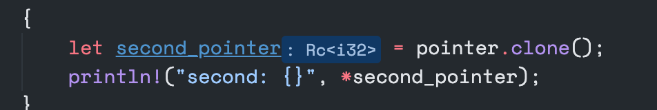
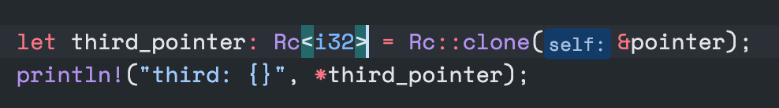

# vscode-rust-analyzer-config

I don't like a inlay hints, so I try to disabled it, mostly I disabled parameter hints, but left type hints (because its same as you declare variables with a type).

## VS Code

Auto format on save

```
"[rust]": {
    "editor.defaultFormatter": "matklad.rust-analyzer",
    "editor.formatOnSave": true
}
```

Disabled All

```
"rust-analyzer.inlayHints.enable": false
```

Type Hints



```
"rust-analyzer.inlayHints.typeHints": false
```

Parameter Hints



```
"rust-analyzer.inlayHints.parameterHints": false
```

Setting : `settings.json`

```json
{
    "[rust]": {
        "editor.defaultFormatter": "matklad.rust-analyzer",
        "editor.formatOnSave": true
    },
    "rust-analyzer.inlayHints.typeHints": false,
    "rust-analyzer.inlayHints.parameterHints": false
}
```

## Neovim

`:CocConfig` - file located at `~/.config/nvim/coc-settings.json`

```json
{
	"rust-analyzer.inlayHints.typeHints": false,
	"rust-analyzer.inlayHints.typeHintsSeparator": false
}
```
